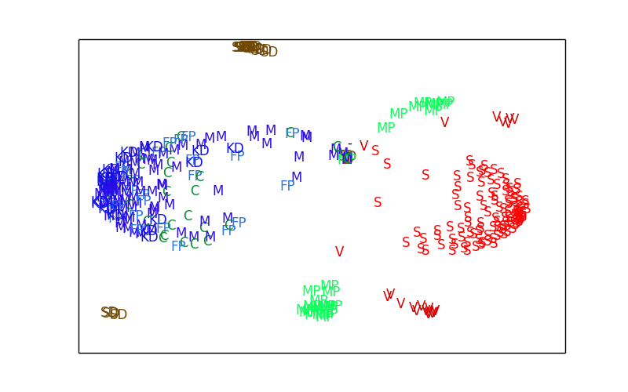

MDS visualizations of the swedish parliament.
=============================
This is a hack that makes [MDS](http://en.wikipedia.org/wiki/Multidimensional_scaling) visualizations based on the voting [data](http://data.riksdagen.se/Data/Voteringar/) from the swedish parliament.

Heavily inspired by chapter 9 of the book [Machine Learning for Hackers](http://shop.oreilly.com/product/0636920018483.do) and the python port available [here](http://nbviewer.ipython.org/urls/raw.github.com/carljv/Will_it_Python/master/MLFH/ch9/ch9.ipynb).

Example
------

How to get it running?
----------------------
Install dependencies
* Python
* Scikit-learn
* Pandas
* Matplotlib

1. Download [data](http://data.riksdagen.se/Data/Voteringar/) from riksdagen and unzip it
2. Run `python prepare_data.py <path to your data> > prepared_data.csv`
3. Run `python plot_data.py prepared_data.csv`
4. Check out the result by opening `prepared_data.csv.png`
 
